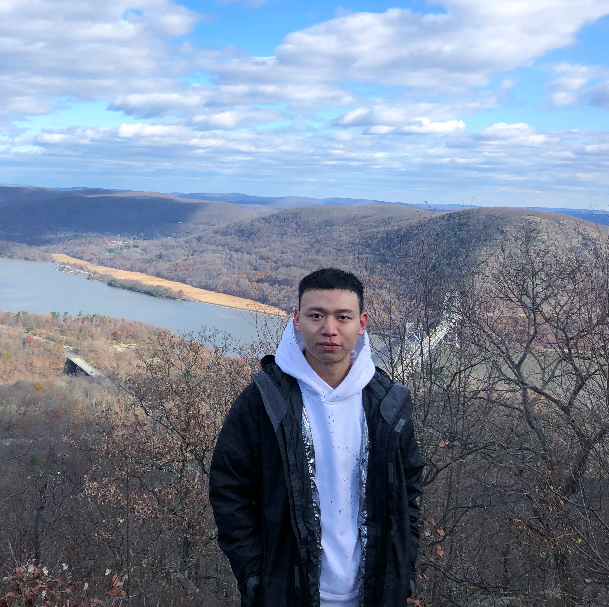
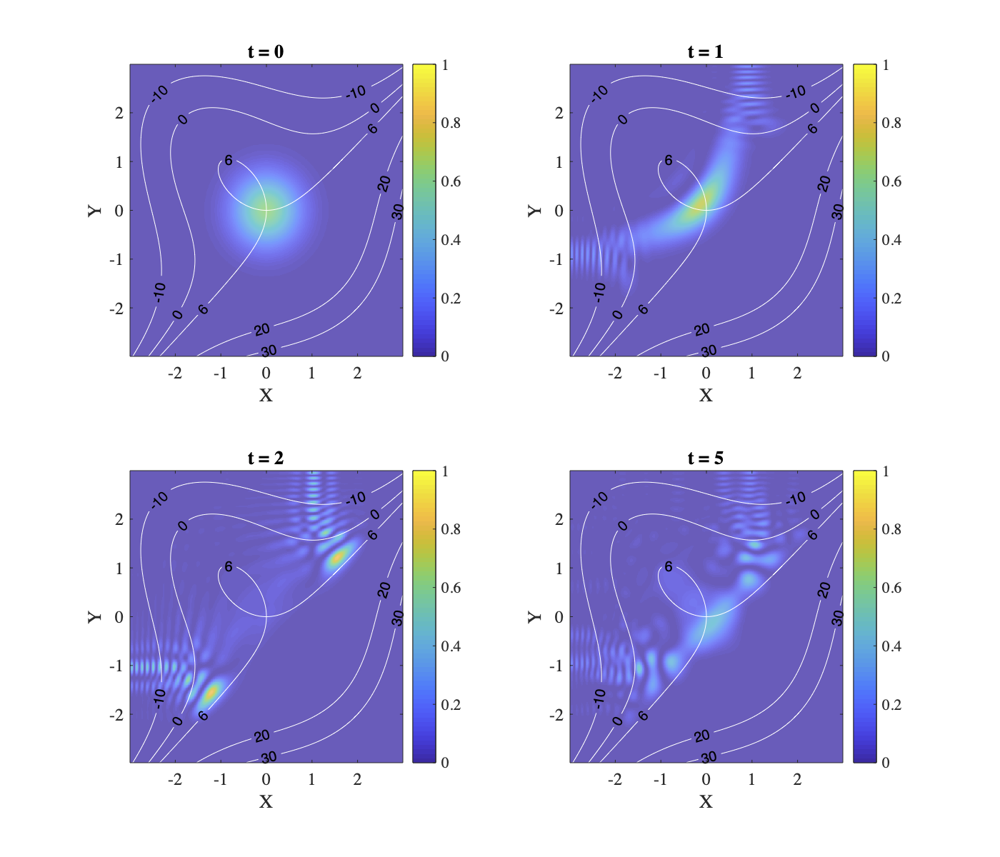

# Jiaqi Leng
***
Welcome to Jiaqi Leng's homepage.

 I am a second-year doctoral student in the [Department of Mathematics](https://www-math.umd.edu/) (track: [applied math](https://amsc.umd.edu/)) at the University of Maryland, College Park. I am also affiliated to [QuICS](https://quics.umd.edu/). I am interested in quantum computing and quantum information. I'm fortunate to be advised by [Xiaodi Wu](https://www.cs.umd.edu/~xwu/).

Prior to Maryland, I graduated in June 2019 with Bachelor of Science (First Class Honours) from the [Faculty of Science, the University of Hong Kong](https://www.scifac.hku.hk/). My Bachelor's thesis is *Turbulence in one spatial dimension*, advised by [Tak Kwong WONG](https://hkumath.hku.hk/~takkwong/). I was also a full-year exchange student at the [University of Chicago](https://mathematics.uchicago.edu/) from 2017 to 2018.

My name in Chinese: 冷佳奇.

&nbsp;

&nbsp;

&nbsp;

## Research
---
I aim to apply advanced mathematics to the design and understanding of quantum algorithms, especially quantum simulations and quantum machine learning. I am particularly interested in near-term and mid-term pratical applications of quantum computing in physics, chemistry, material sciences, and optimizations. I am also intrigued by quantum information geometry and its potential application to quantum algorithms.

&nbsp;

*: equal contribution
####  **Quantum Algorithms for Escaping from Saddle Points**

Chenyi Zhang\*, **Jiaqi Leng \***, Tongyang Li. **Contributed talk** at the 24th Annual Conference on Quantum Information Processing ([QIP 2021](https://www.mcqst.de/qip2021/)). [[PDF]](https://arxiv.org/abs/2007.10253)

&nbsp;

&nbsp;

## Talks
---
#### **Quantum algorithms for escaping from saddle point**

February 2, 2021. [QIP 2021](https://www.mcqst.de/qip2021/). [[Slides]](qip2021_leng.pdf) [[Video]](https://www.youtube.com/watch?v=xbHqktWa354&list=PL5DZ45amUsqIaqE9EIemfc9LzeWzXnGY_&index=76)

####  **Quantum search algorithm and discrete Schrodinger dynamics**

March 6, 2020. [Student AMSC Seminar](https://www-math.umd.edu/research/seminars/student-amsc-seminar.html), UMD. [[Slides]](2020Mar6_amsc_student.pdf)

&nbsp;

&nbsp;

## Contact
---
(Due to the pandemic of COVID-19 and restricted operations in the University, the assignment of office has been delayed. I will update contact infomation once available.)

Office: TBA

Address: TBA

Email: jiaqil (at) umd.edu
